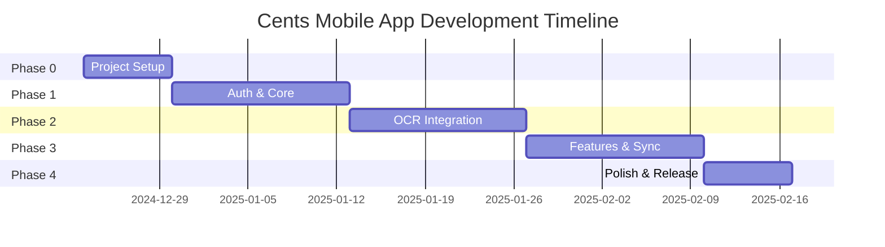

# Cents Mobile App - Implementation Plan

**Version**: 1.0  
**Last Updated**: 2024-12-18  
**Timeline**: 8 weeks to MVP

---

## Phase Overview



---

## Phase 0: Project Foundation (Week 1)

**Goal**: Establish development environment, project structure, and CI/CD pipeline.

### Deliverables

- [ ] Expo project initialized with TypeScript
- [ ] Development environment documented
- [ ] Git repository structured
- [ ] CI/CD workflow for linting/testing
- [ ] Supabase connection verified
- [ ] Design tokens established

### Tasks

#### Day 1-2: Project Initialization

```bash
# Create Expo project
npx create-expo-app@latest cents-mobile --template expo-template-blank-typescript

# Navigate to project
cd cents-mobile

# Install Expo Router
npx expo install expo-router expo-linking expo-constants expo-status-bar

# Install core dependencies
npx expo install @supabase/supabase-js
npx expo install expo-secure-store @react-native-async-storage/async-storage
npx expo install @tanstack/react-query
npm install zustand

# Install UI dependencies
npx expo install react-native-paper react-native-safe-area-context
npx expo install lucide-react-native react-native-svg

# Install development dependencies
npm install -D @types/react jest @testing-library/react-native
```

#### Day 2-3: Configure Expo Router

```typescript
// app/_layout.tsx
import { Stack } from 'expo-router';
import { QueryClient, QueryClientProvider } from '@tanstack/react-query';
import { AuthProvider } from '@/contexts/AuthContext';

const queryClient = new QueryClient();

export default function RootLayout() {
  return (
    <QueryClientProvider client={queryClient}>
      <AuthProvider>
        <Stack screenOptions={{ headerShown: false }} />
      </AuthProvider>
    </QueryClientProvider>
  );
}
```

#### Day 3-4: Set Up Supabase Client

```typescript
// lib/supabase.ts
import 'react-native-url-polyfill/auto';
import { createClient } from '@supabase/supabase-js';
import * as SecureStore from 'expo-secure-store';

const ExpoSecureStoreAdapter = {
  getItem: (key: string) => SecureStore.getItemAsync(key),
  setItem: (key: string, value: string) => SecureStore.setItemAsync(key, value),
  removeItem: (key: string) => SecureStore.deleteItemAsync(key),
};

export const supabase = createClient(
  process.env.EXPO_PUBLIC_SUPABASE_URL!,
  process.env.EXPO_PUBLIC_SUPABASE_PUBLISHABLE_DEFAULT_KEY!,
  {
    auth: {
      storage: ExpoSecureStoreAdapter,
      autoRefreshToken: true,
      persistSession: true,
      detectSessionInUrl: false,
    },
  }
);
```

#### Day 4-5: CI/CD Pipeline

```yaml
# .github/workflows/mobile.yml
name: Mobile CI

on:
  push:
    branches: [main]
    paths:
      - 'apps/mobile/**'
      - 'packages/**'
  pull_request:
    branches: [main]
    paths:
      - 'apps/mobile/**'
      - 'packages/**'

jobs:
  lint-and-test:
    runs-on: ubuntu-latest
    defaults:
      run:
        working-directory: apps/mobile
    steps:
      - uses: actions/checkout@v4
      
      - name: Setup Node.js
        uses: actions/setup-node@v4
        with:
          node-version: '20'
          cache: 'npm'
          
      - name: Install dependencies
        run: npm ci
        
      - name: Run linter
        run: npm run lint
        
      - name: Run TypeScript check
        run: npx tsc --noEmit
        
      - name: Run tests
        run: npm test

  # Note: Only run EAS builds on main merge to conserve build credits
  eas-build:
    needs: lint-and-test
    if: github.ref == 'refs/heads/main' && github.event_name == 'push'
    runs-on: ubuntu-latest
    steps:
      - uses: actions/checkout@v4
      
      - uses: expo/expo-github-action@v8
        with:
          eas-version: latest
          token: ${{ secrets.EXPO_TOKEN }}
          
      - name: Build (development client)
        run: |
          cd apps/mobile
          eas build --platform all --profile development --non-interactive
```

#### Day 5-7: Design System Setup

```typescript
// theme/index.ts
export const colors = {
  // Match web app dark theme
  background: '#09090b',      // zinc-950
  card: '#18181b',            // zinc-900
  border: '#27272a',          // zinc-800
  text: {
    primary: '#fafafa',       // zinc-50
    secondary: '#a1a1aa',     // zinc-400
    muted: '#71717a',         // zinc-500
  },
  accent: {
    emerald: '#10b981',       // emerald-500
    emeraldLight: '#34d399',  // emerald-400
    emeraldDark: '#059669',   // emerald-600
  },
  semantic: {
    error: '#ef4444',
    warning: '#f59e0b',
    success: '#10b981',
  },
};

export const spacing = {
  xs: 4,
  sm: 8,
  md: 16,
  lg: 24,
  xl: 32,
  xxl: 48,
};

export const typography = {
  heading1: { fontSize: 28, fontWeight: '700' as const },
  heading2: { fontSize: 22, fontWeight: '600' as const },
  heading3: { fontSize: 18, fontWeight: '600' as const },
  body: { fontSize: 16, fontWeight: '400' as const },
  caption: { fontSize: 14, fontWeight: '400' as const },
  small: { fontSize: 12, fontWeight: '400' as const },
};
```

### Success Criteria

- [ ] `expo start` launches successfully
- [ ] Can connect to Supabase and log current user (null)
- [ ] GitHub Actions runs lint + type check on PRs
- [ ] EAS build triggered manually succeeds
- [ ] Theme tokens match web app design

---

## Phase 1: Core Functionality (Weeks 2-3)

**Goal**: Implement authentication and expense CRUD operations.

### Deliverables

- [ ] Login/signup screens
- [ ] Tab navigation (Dashboard, Expenses, Budgets, Settings)
- [ ] Expense list with infinite scroll
- [ ] Manual expense creation form
- [ ] Expense edit/delete
- [ ] Category selection

### Tasks

#### Week 2: Authentication

| Task | Estimated Time |
|------|---------------|
| Login screen UI | 4h |
| Signup screen UI | 3h |
| Auth context implementation | 4h |
| Protected routes with Expo Router | 3h |
| Session persistence | 2h |
| Password reset flow | 3h |
| Error handling and validation | 3h |
| **Testing & refinement** | 6h |
| **Total** | ~28h |

```typescript
// app/(auth)/login.tsx
import { useState } from 'react';
import { View, TextInput, Pressable, Text, StyleSheet } from 'react-native';
import { router } from 'expo-router';
import { useAuth } from '@/contexts/AuthContext';

export default function LoginScreen() {
  const [email, setEmail] = useState('');
  const [password, setPassword] = useState('');
  const [error, setError] = useState('');
  const { signIn, loading } = useAuth();

  const handleSignIn = async () => {
    try {
      await signIn(email, password);
      router.replace('/(tabs)');
    } catch (e: any) {
      setError(e.message);
    }
  };

  return (
    <View style={styles.container}>
      <Text style={styles.title}>Welcome back</Text>
      {error && <Text style={styles.error}>{error}</Text>}
      <TextInput
        style={styles.input}
        placeholder="Email"
        value={email}
        onChangeText={setEmail}
        autoCapitalize="none"
        keyboardType="email-address"
      />
      <TextInput
        style={styles.input}
        placeholder="Password"
        value={password}
        onChangeText={setPassword}
        secureTextEntry
      />
      <Pressable 
        style={[styles.button, loading && styles.buttonDisabled]} 
        onPress={handleSignIn}
        disabled={loading}
      >
        <Text style={styles.buttonText}>
          {loading ? 'Signing in...' : 'Sign In'}
        </Text>
      </Pressable>
    </View>
  );
}
```

#### Week 3: Expense Management

| Task | Estimated Time |
|------|---------------|
| Tab navigator setup | 2h |
| Expense list screen | 4h |
| Expense list item component | 2h |
| Infinite scroll / pagination | 4h |
| Create expense screen | 4h |
| Date picker integration | 2h |
| Category picker modal | 3h |
| Edit expense screen | 2h |
| Delete with confirmation | 1h |
| Pull to refresh | 1h |
| Empty states | 2h |
| **Testing & refinement** | 6h |
| **Total** | ~33h |

```typescript
// hooks/useExpenses.ts
import { useInfiniteQuery, useMutation, useQueryClient } from '@tanstack/react-query';
import { supabase } from '@/lib/supabase';
import { Expense } from '@expensely/shared/types';

const PAGE_SIZE = 20;

export function useExpenses() {
  return useInfiniteQuery({
    queryKey: ['expenses'],
    queryFn: async ({ pageParam = 0 }) => {
      const { data, error } = await supabase
        .from('expenses')
        .select('*, categories(*)')
        .order('expense_date', { ascending: false })
        .range(pageParam, pageParam + PAGE_SIZE - 1);
      
      if (error) throw error;
      return data as Expense[];
    },
    getNextPageParam: (lastPage, pages) => {
      if (lastPage.length < PAGE_SIZE) return undefined;
      return pages.length * PAGE_SIZE;
    },
  });
}

export function useCreateExpense() {
  const queryClient = useQueryClient();
  
  return useMutation({
    mutationFn: async (expense: Omit<Expense, 'id' | 'created_at' | 'updated_at'>) => {
      const { data, error } = await supabase
        .from('expenses')
        .insert(expense)
        .select()
        .single();
      
      if (error) throw error;
      return data;
    },
    onSuccess: () => {
      queryClient.invalidateQueries({ queryKey: ['expenses'] });
    },
  });
}
```

### Success Criteria

- [ ] Can sign up, log in, and log out
- [ ] Session persists across app restarts
- [ ] Can view expense list with pagination
- [ ] Can create expense with category
- [ ] Can edit and delete expenses
- [ ] Data syncs with web app database

---

## Phase 2: OCR Integration (Weeks 4-5)

**Goal**: Implement on-device receipt scanning using platform-native APIs.

### Deliverables

- [ ] Camera capture for receipts
- [ ] Image picker for gallery photos
- [ ] On-device OCR (iOS Vision, Android ML Kit)
- [ ] Receipt parsing (port from web)
- [ ] Pre-filled expense form
- [ ] User correction UI

### Tasks

#### Week 4: Camera & Image Handling

| Task | Estimated Time |
|------|---------------|
| Install expo-camera | 1h |
| Camera permission flow | 2h |
| Receipt capture screen | 4h |
| Image preview & crop | 4h |
| Image picker integration | 2h |
| Image compression | 2h |
| **Testing on devices** | 6h |
| **Total** | ~21h |

#### Week 5: OCR Implementation

| Task | Estimated Time |
|------|---------------|
| Research ML Kit / Vision APIs | 4h |
| iOS Vision native module | 8h |
| Android ML Kit native module | 8h |
| Unified OCR interface | 2h |
| Port receiptParser.ts | 4h |
| Pre-fill form with OCR data | 3h |
| Confidence indicators | 2h |
| **Testing & refinement** | 8h |
| **Total** | ~39h |

### OCR Implementation Options

#### Option 1: react-native-mlkit-ocr (Simpler)

```bash
npm install react-native-mlkit-ocr
```

```typescript
// services/ocr/mlkit.ts
import MlkitOcr from 'react-native-mlkit-ocr';
import { parseReceipt } from '@expensely/shared/receiptParser';

export async function scanReceipt(imagePath: string) {
  const result = await MlkitOcr.detectFromFile(imagePath);
  const text = result.map(block => block.text).join('\n');
  return parseReceipt(text);
}
```

#### Option 2: Custom Native Modules (Better control)

For iOS Vision, create a native module:

```objc
// ios/VisionOCR.swift
import Vision
import UIKit

@objc(VisionOCR)
class VisionOCR: NSObject {
  
  @objc
  func recognizeText(_ imagePath: String, 
                     resolver: @escaping RCTPromiseResolveBlock,
                     rejecter: @escaping RCTPromiseRejectBlock) {
    
    guard let image = UIImage(contentsOfFile: imagePath),
          let cgImage = image.cgImage else {
      rejecter("ERROR", "Could not load image", nil)
      return
    }
    
    let request = VNRecognizeTextRequest { request, error in
      if let error = error {
        rejecter("ERROR", error.localizedDescription, error)
        return
      }
      
      guard let observations = request.results as? [VNRecognizedTextObservation] else {
        resolver(["text": "", "confidence": 0])
        return
      }
      
      let text = observations.compactMap { 
        $0.topCandidates(1).first?.string 
      }.joined(separator: "\n")
      
      let confidence = observations.reduce(0.0) { sum, obs in
        sum + (obs.topCandidates(1).first?.confidence ?? 0)
      } / Double(max(observations.count, 1))
      
      resolver(["text": text, "confidence": confidence])
    }
    
    request.recognitionLevel = .accurate
    request.usesLanguageCorrection = true
    
    let handler = VNImageRequestHandler(cgImage: cgImage, options: [:])
    try? handler.perform([request])
  }
}
```

### Success Criteria

- [ ] Can capture receipt with camera
- [ ] Can select receipt from gallery
- [ ] OCR extracts text on-device (no network calls)
- [ ] Merchant, total, date pre-filled correctly
- [ ] User can correct any extracted field
- [ ] Works offline

---

## Phase 3: Dashboard & Features (Weeks 6-7)

**Goal**: Implement dashboard visualizations, budget tracking, and offline support.

### Deliverables

- [ ] Dashboard with spending summary
- [ ] Category breakdown chart
- [ ] Monthly comparison
- [ ] Budget management
- [ ] Offline queue
- [ ] Settings screen

### Tasks

#### Week 6: Dashboard & Budgets

| Task | Estimated Time |
|------|---------------|
| Dashboard layout | 3h |
| Spending summary card | 2h |
| Victory Native charts setup | 3h |
| Category pie chart | 4h |
| Monthly bar chart | 4h |
| Budget list screen | 3h |
| Create/edit budget | 3h |
| Budget progress bars | 2h |
| **Testing** | 4h |
| **Total** | ~28h |

```typescript
// app/(tabs)/index.tsx - Dashboard
import { View, Text, ScrollView } from 'react-native';
import { useDashboardData } from '@/hooks/useDashboardData';
import { SpendingSummary } from '@/components/SpendingSummary';
import { CategoryChart } from '@/components/CategoryChart';
import { RecentTransactions } from '@/components/RecentTransactions';
import { BudgetProgress } from '@/components/BudgetProgress';

export default function DashboardScreen() {
  const { data, isLoading } = useDashboardData();

  if (isLoading) {
    return <DashboardSkeleton />;
  }

  return (
    <ScrollView style={styles.container}>
      <Text style={styles.greeting}>Good morning!</Text>
      
      <SpendingSummary 
        total={data.monthlyTotal}
        change={data.monthOverMonthChange}
      />
      
      <CategoryChart data={data.categoryBreakdown} />
      
      <BudgetProgress budgets={data.budgets} />
      
      <RecentTransactions transactions={data.recentExpenses} />
    </ScrollView>
  );
}
```

#### Week 7: Offline & Settings

| Task | Estimated Time |
|------|---------------|
| Offline detection hook | 2h |
| Offline queue implementation | 4h |
| Sync indicator UI | 2h |
| Background sync on reconnect | 3h |
| Settings screen layout | 2h |
| Profile editing | 2h |
| App preferences (theme, currency) | 3h |
| Logout functionality | 1h |
| About / version info | 1h |
| **Testing** | 4h |
| **Total** | ~24h |

### Success Criteria

- [ ] Dashboard shows accurate spending summary
- [ ] Charts render correctly with data
- [ ] Can create and track budgets
- [ ] Can add expenses while offline
- [ ] Offline expenses sync when online
- [ ] Settings allow profile changes

---

## Phase 4: Polish & Release (Week 8)

**Goal**: Testing, performance optimization, and app store preparation.

### Deliverables

- [ ] Comprehensive testing
- [ ] Performance optimization
- [ ] App store assets
- [ ] Release builds

### Tasks

| Task | Estimated Time |
|------|---------------|
| E2E testing with Detox | 8h |
| Performance profiling | 4h |
| Bundle size optimization | 3h |
| App icons & splash screen | 2h |
| App store screenshots | 3h |
| App store descriptions | 2h |
| TestFlight / Internal testing build | 2h |
| Bug fixes from testing | 8h |
| Final EAS production build | 2h |
| **Total** | ~34h |

### Testing Strategy

#### Unit Tests (Jest + Testing Library)

```typescript
// __tests__/receiptParser.test.ts
import { parseReceipt } from '@/lib/receiptParser';

describe('parseReceipt', () => {
  it('extracts total from standard format', () => {
    const text = 'COSTCO WHOLESALE\nTOTAL $97.18\n12/18/2024';
    const result = parseReceipt(text);
    
    expect(result.merchant).toBe('Costco');
    expect(result.total).toBe(97.18);
    expect(result.date).toBe('2024-12-18');
  });
});
```

#### E2E Tests (Detox)

```typescript
// e2e/expenseFlow.test.ts
describe('Expense Flow', () => {
  beforeAll(async () => {
    await device.launchApp();
    await loginAsTestUser();
  });

  it('should create an expense', async () => {
    await element(by.id('add-expense-button')).tap();
    await element(by.id('amount-input')).typeText('42.50');
    await element(by.id('category-picker')).tap();
    await element(by.text('Groceries')).tap();
    await element(by.id('save-button')).tap();
    
    await expect(element(by.text('$42.50'))).toBeVisible();
  });
});
```

### Performance Checklist

- [ ] Cold start < 2 seconds
- [ ] Hermes JavaScript engine enabled
- [ ] Large lists use FlashList
- [ ] Images optimized and cached
- [ ] No memory leaks in navigation
- [ ] API calls deduplicated

### App Store Assets

| Asset | iOS | Android |
|-------|-----|---------|
| Icon | 1024x1024 | 512x512 |
| Splash | 1284x2778 | 1080x1920 |
| Screenshots | 6 screens | 6 screens |
| Feature graphic | - | 1024x500 |

### Success Criteria

- [ ] All E2E tests pass
- [ ] No critical bugs
- [ ] Performance targets met
- [ ] TestFlight build approved
- [ ] Ready for App Store submission

---

## Build Strategy: Maximizing Local Development

> ⚠️ **EAS Constraint**: 15 builds/month on free tier

### Local Development (Daily)

```bash
# iOS Simulator (no EAS build needed)
npx expo start --ios

# Android Emulator (no EAS build needed)  
npx expo start --android

# Local development build (first time only)
npx expo run:ios
npx expo run:android
```

### When to Use EAS Builds

| Scenario | Build Type | Frequency |
|----------|------------|-----------|
| PR validation | ❌ Skip | Never |
| Feature testing | Local | Daily |
| Native module testing | Local dev build | Weekly |
| Team testing | EAS Development | 1-2x/week |
| Beta release | EAS Preview | 2x/month |
| Production release | EAS Production | 1x/month |

### Recommended EAS Build Allocation (15/month)

| Purpose | iOS | Android | Total |
|---------|-----|---------|-------|
| Development client | 2 | 2 | 4 |
| Preview/testing | 2 | 2 | 4 |
| Production | 2 | 2 | 4 |
| Buffer | - | - | 3 |
| **Total** | 6 | 6 | **15** |

### Local Native Build Script

```json
// package.json
{
  "scripts": {
    "dev": "expo start",
    "dev:ios": "expo run:ios",
    "dev:android": "expo run:android",
    "build:local:ios": "expo run:ios --configuration Release",
    "build:local:android": "expo run:android --variant release",
    "prebuild": "expo prebuild",
    "eas:dev": "eas build --profile development --platform all",
    "eas:preview": "eas build --profile preview --platform all",
    "eas:prod": "eas build --profile production --platform all"
  }
}
```

---

## Risk Mitigation

| Risk | Mitigation |
|------|------------|
| OCR accuracy varies | Fallback to manual entry; user corrections |
| Native modules complexity | Use existing libraries first (react-native-mlkit-ocr) |
| EAS builds exceeded | Prioritize local dev; use Expo Go for quick iterations |
| Supabase schema drift | Share types package; sync migrations |
| React Native learning curve | Leverage Expo abstractions; stick to core patterns |

---

## Team Resources

### Documentation

- [Expo Documentation](https://docs.expo.dev/)
- [React Native Paper](https://callstack.github.io/react-native-paper/)
- [Supabase React Native Guide](https://supabase.com/docs/guides/getting-started/tutorials/with-expo)
- [Victory Native Charts](https://commerce.nearform.com/open-source/victory/docs/native)

### Tools

- Expo Go app (iOS/Android) - Quick testing
- Android Studio - Android emulator
- Xcode - iOS simulator
- Reactotron - Debugging
- Flipper - Native debugging

---

## Appendix: Command Reference

```bash
# Development
expo start                    # Start development server
expo start --clear            # Clear cache and start
expo start --ios              # Open iOS simulator
expo start --android          # Open Android emulator

# Local Native Builds
expo prebuild                 # Generate native code
expo run:ios                  # Build and run iOS locally
expo run:android              # Build and run Android locally

# EAS Builds (use sparingly!)
eas build --profile development --platform ios
eas build --profile preview --platform android
eas build --profile production --platform all

# Testing
npm test                      # Run unit tests
npm run test:e2e              # Run E2E tests (Detox)

# Code Quality
npm run lint                  # ESLint
npx tsc --noEmit              # TypeScript check
```
