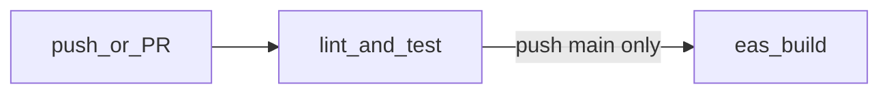

# CI

GitHub Actions runs lint, formatting checks, TypeScript, tests with coverage, verifies generated CI documentation and TypeDoc markdown under `docs/generated/`, and runs `expo-doctor`. EAS builds run only on pushes to `main` to limit build credits.

## Human-written summary

| Item | Detail |
| --- | --- |
| Workflow file | [`.github/workflows/ci.yml`](../.github/workflows/ci.yml) |
| Primary job | `lint-and-test` (required for merges) |
| EAS job | `eas-build` — only `push` to `main`, after `lint-and-test` |
| Node | 20.x, npm cache enabled |

### Secrets

| Secret | Used by | Notes |
| --- | --- | --- |
| `EXPO_TOKEN` | `eas-build` | Expo account token for non-interactive builds. Not needed for `lint-and-test`. Forks without this secret still get full checks except EAS. |

### Local commands (mirror CI)

```bash
npm ci
npm run generate-ci-docs && git diff --exit-code docs/generated/ci-pipeline.md
npm run docs:api && git diff --exit-code docs/generated/api-md
npm run format:check
npm run lint
npm run typecheck
npm run test:ci
npx expo-doctor
```

Regenerate the pipeline doc after editing the workflow:

```bash
npm run generate-ci-docs
```

### Coverage thresholds

[`jest.config.js`](../jest.config.js) enforces modest global thresholds on `lib/`, `hooks/`, and `contexts/`. Percentages are intentionally low so CI stays green while the suite grows; raise them as you add tests.

### Expo Doctor

The workflow runs `npx expo-doctor` as a required step after dependency alignment with `npx expo install --fix` for the target SDK.

### API documentation

TypeDoc emits Markdown to [`docs/generated/api-md`](generated/api-md). Regenerate after changing documented modules:

```bash
npm run docs:api
```

## Generated reference (machine-readable)

The step-by-step pipeline is generated from the workflow YAML so it cannot drift:

- **[`docs/generated/ci-pipeline.md`](generated/ci-pipeline.md)**

## Branch protections (recommended)

- Require PR reviews (1+)
- Require the `lint-and-test` check to pass before merge
- Treat `eas-build` as optional unless you want releases gated on EAS
- Require linear history where practical; disallow force-push to `main`

## Flow


