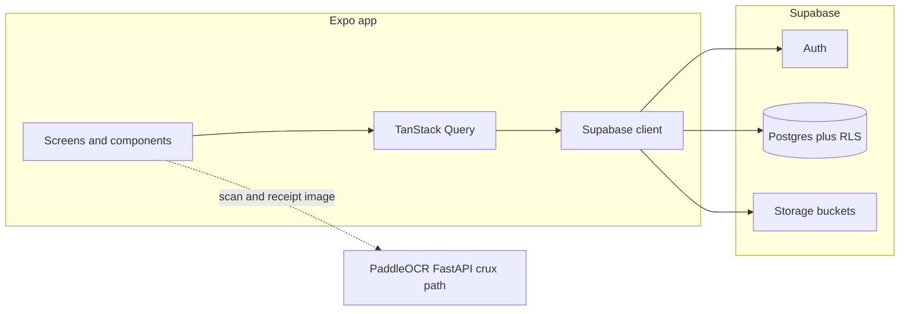

# Architecture

## Why this matters

Cents keeps most product logic in **hooks** and **lib** so screens stay thin. Understanding the default data flow makes it easier to add features without breaking RLS assumptions or React Query caching.

## High-level system

The **OCR service** is the critical path for scan-to-expense: it is optional only in the sense that you may omit `EXPO_PUBLIC_OCR_API_URL`, but product-quality capture assumes you operate it alongside Supabase ([OCR guide](./ocr-service.md), [TypeDoc: lib/receiptOcr](/api/modules/lib_receiptOcr.html)).

## App structure

| Layer | Role |
| --- | --- |
| `app/` | Expo Router routes, layouts, and tab stacks. |
| `contexts/` | Cross-cutting providers (e.g. auth). |
| `hooks/` | React Query hooks wrapping Supabase reads/writes. |
| `components/` | Shared UI (forms, lists, charts). |
| `theme/` | Colors, spacing, typography. |
| `lib/` | Pure helpers, OCR mapping, notifications, etc. |

## Navigation

- **Auth** — `app/(auth)/` (login, signup, forgot password).
- **Main tabs** — `app/(tabs)/` after sign-in.
- **Expense detail** — `app/expenses/[id].tsx`.

Routing is file-based; deep links follow Expo Router conventions.

## Data flow

1. UI calls hooks under `hooks/` (e.g. `useExpenses`, `useDashboardStats`).
2. Hooks use the shared Supabase client (`lib/supabase`) and TanStack Query for cache keys, stale times, and invalidation.
3. Mutations set `user_id` where required and rely on **RLS** as the backstop ([Backend & security](./backend-security.md)).

## Security defaults (application)

- Do not log tokens, passwords, or raw receipt payloads in production paths.
- Treat every query as **user-scoped** even when RLS exists — clearer code and safer refactors.

## Performance defaults

- React Query uses tuned `staleTime` on dashboard and category hooks.
- Expense lists use pagination; avoid heavy work inside list `renderItem` callbacks.
- Chart components should stay memo-friendly; profile if the JS thread spikes on low-end devices ([Performance](./performance.md)).

## Next

[Backend & security](./backend-security.md) — turn this architecture into a verifiable Supabase checklist.
